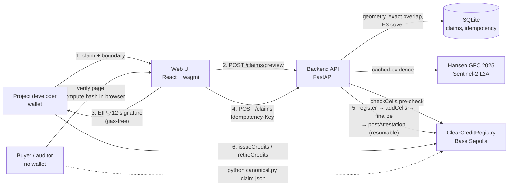
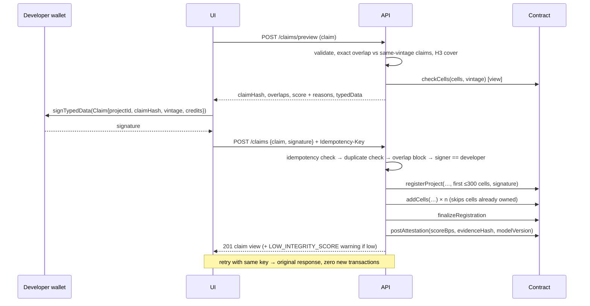

# ClearCredit Architecture

## Components

| Component | Responsibility | Code |
|---|---|---|
| Contract | Claim registry. Uniqueness of `claimHash`, `projectId` and (H3 cell, vintage). EIP-712 developer-consent check. Append-only attestations. Score-gated issuance. Sequential retirement serials. Roles: admin, registrar, verifier. | `contracts/contracts/ClearCreditRegistry.sol` |
| Canonicalization | Deterministic claim encoding and `claimHash`. A standalone CLI for third parties. | `backend/app/canonical.py` |
| Geometry | Validation, geodesic area (WGS84), exact overlap fractions, H3 center-containment cover. | `backend/app/geo.py` |
| Evidence | Hansen tree-cover loss (30 m) and Sentinel-2 NDVI trend. Cached per canonical boundary with `evidenceHash`. | `backend/app/satellite.py` |
| Scoring | Rule-based 0–100 integrity score with plain-language reasons (versioned `modelVersion`). | `backend/app/scoring.py` |
| Relay | web3 client. Resumable registration and retry-safe attestation. | `backend/app/chain.py` |
| API | Preview, idempotent submit, verify, overlaps, registry, schema. | `backend/app/main.py`, OpenAPI at `/docs` |
| Store | SQLite: claims and idempotency records. | `backend/app/store.py` |
| Frontend | Submit (wallet), Verify (public), Registry, About/Limits; developer actions (issue/retire). | `frontend/` |
| Seed pipeline | Real boundaries plus real issuance become claim files, then evidence cache, then registration through the public API. | `backend/scripts/` |

## Submission sequence

## Data model

**Off-chain (authoritative for geometry):**
- the full claim JSON
- exact overlaps
- the evidence bundle
- score features and reasons
- transaction hashes

**On-chain (authoritative for integrity and uniqueness):**
- `projects[projectKey]`: `{developer, claimHash, vintageYear, status, claimedCredits, issued, retired, cellCount, registeredAt}`
- `cellClaim[cell][vintage] → projectKey`
- `attestations[projectKey][]`: `{scoreBps, evidenceHash, modelVersion, verifier, timestamp}`
- `retirements[projectKey][]`: `{serialStart, amount, from, beneficiary, timestamp}`

## Key design decisions

See `DECISIONS.md`. In short:
- **Signed relay.** The backend pays gas, but it can't register anything a developer didn't sign.
- **Center-containment cells.** Neighbouring projects never conflict on-chain; real overlaps do.
- **Integer micro-degree canonicalization.** Hashes match byte-for-byte across Python and JavaScript.
- **Resumable relay plus idempotency keys.** Signed transactions are journaled in SQLite
  before broadcast. Receipt timeouts keep the same bytes/hash/nonce; the relay reconciles
  the uncertain send before checking state or allocating another nonce. Run one API worker
  and one Chain instance per relayer key. A stuck/replaced transaction requires operator
  reconciliation; the journal deliberately blocks further sends rather than guessing.
- **SQLite, not PostGIS.** Fewer moving parts. Shapely handles exact geometry, and the claim volume is small.

## Why a blockchain rather than a database

The parties checking for double counting don't trust each other: project developers, registries, buyers and auditors. A database run by any one of them can be quietly edited. The contract gives them three things:
1. A shared uniqueness rule that no single operator can bypass. The backend-bypass test shows that a second operator with an empty database is still blocked.
2. Tamper evidence for every registered claim, checkable by anyone with the claim file.
3. Retirement serials that cannot overlap.

What it does **not** give is physical truth. That is why every attestation carries satellite evidence and an `evidenceHash`.

## Scaling path

- **Multiple registries:** each registry runs a registrar against the same contract (or an L2 deployment), and the shared cell index gives cross-registry uniqueness.
- **Large projects:** cells are batched (300 per transaction, ~7M gas). At resolution 8 a 100,000 ha project is about 1,360 cells, or five transactions.
- **Verification:** attestations are versioned, so new models append rather than overwrite. Multiple independent verifiers could be required (quorum) in production.
- **Evidence:** the cache is keyed by canonical boundary, so recomputation is incremental and parallel.
